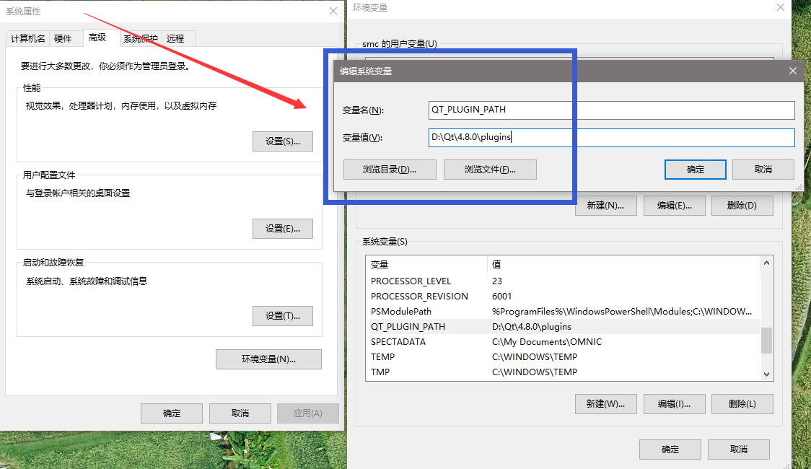
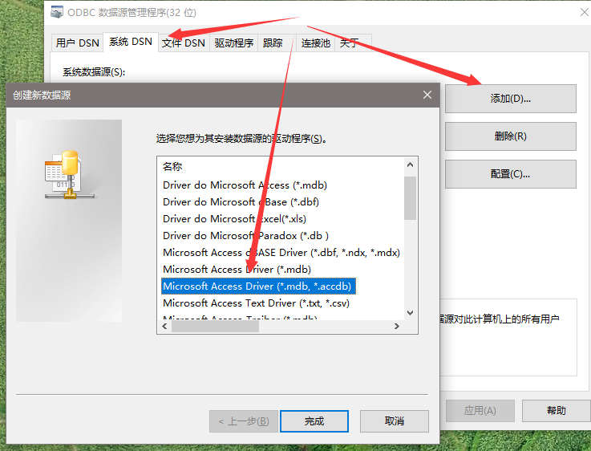
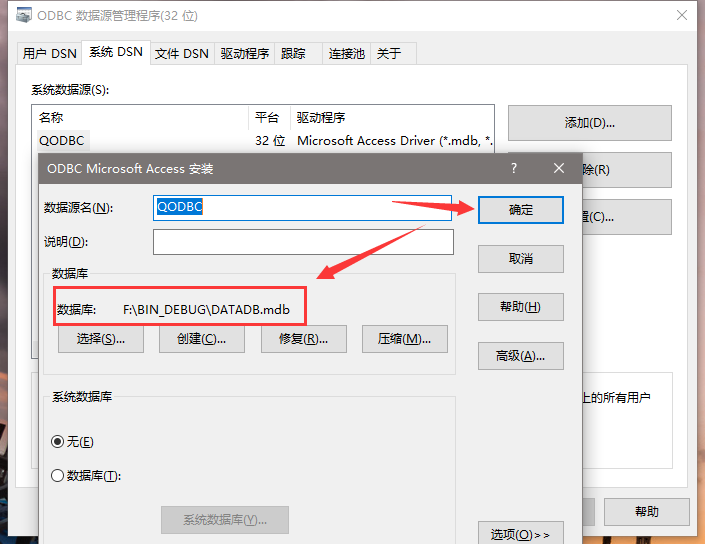

> 本软件是windows 32位的程序,需要兼容XP系统
# ClientHeZhiTest
- IDE：visual studio 2008 + QT4.8.0 + qt-vs-addin-1.1.11
- vs2008不支持C++11
- QT4用widget，qml是QT5才支持

## 数据库环境
- 数据库用Office里面的**Access**数据库
- 需要安装Office 32位的程序，开发环境用的是Office 2016 32位，64位需要卸载掉
- 需要添加系统变量**QT_PLUGIN_PATH**，路径为：qt4.8.0安装路径\plugins
    
- 配置ODBC数据源管理程序(32位)：路径C:\WINDOWS\syswow64\odbcad32.exe

    1）确定好要操作的数据库文件：***.mdb

    2）系统DSN下添加驱动程序【Microsoft Access Driver(*.mdb, *.accdb)】
    
    3）选择要操作的mdb数据然后确定
    

- 【可选】安装Access驱动，去官网下载后有一个安装程序**accessdatabaseengine.exe**